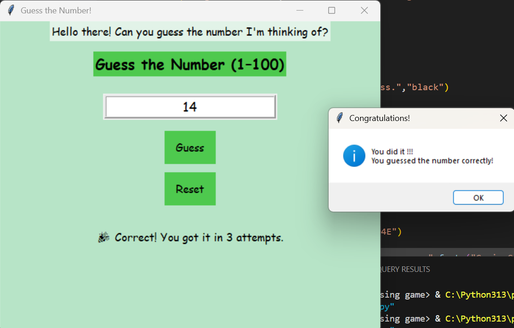

# 🎯 Guess the Number Game - PRODIGY_SD_02

A beautifully designed interactive number guessing game built with **Python** and **Tkinter**.  
This mini-game challenges users to guess a randomly generated number between 1 and 100 — with logical hints, animations, and celebration effects! 🧠🎉

---

## 📸 Screenshot



---

## ✨ Features

- 🎮 GUI-based guessing game using Tkinter
- 🔍 Real-time hints: even/odd, range, closeness
- ⌨️ Typing animation for each message
- 🎉 Victory popup when guessed correctly
- 🔁 Reset button for fresh new game
- 💖 Beautiful fonts, layout, and button animations

---

## 🛠 Tech Stack

- 🐍 Python 3
- 🪟 Tkinter (GUI library)
- 🧠 Conditional logic & user interaction
- 🎨 Custom font, color, and animation styling

---

##  Developed By

**Vaishnavi Lalan**
💼 Software Development Intern at Prodigy Infotech  
🔗  [LinkedIn](https://www.linkedin.com/in/vaishnavi-lalan-270419310?lipi=urn%3Ali%3Apage%3Ad_flagship3_profile_view_base_contact_details%3BVwT8INsySK2z6a6jBPPJ1A%3D%3D) | [GitHub Profile](https://github.com/VaishnaviLalan106)

---

## 📂 Folder Structure
```
PRODIGY_SD_02/
│
├── guessing_game.py
├── README.md
└── screenshot.png  ```

---
